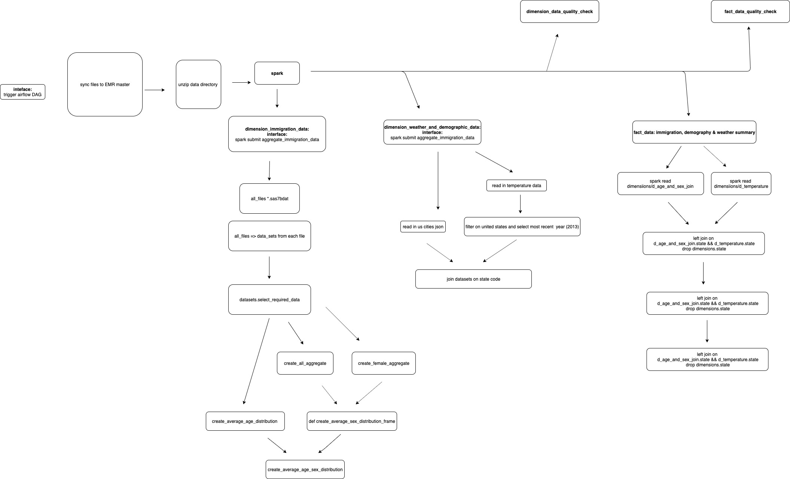

# CAPSTONE PROJECT | Daniel Miller

## Airflow Pipeline To Combine and Aggregate US Immigration, Temperature & Demographic Data To Understand Immigration Per State

### Project Overview

The project uses spark for data processing and airflow as an orchestration tool. Immigration, Demographic & Temperature Data for the United States is combined and then summarized. The summary describes immigration per state per month & the distribution of male and female immigrants. 

This data is then joined with aggregate temperature and demographic data.

The end result is a high level overview of:

* what states are the most popular
* what are the peak immigration periods
* the demography and climate of the states

### App Architecture

### Setup

* Clone the repo 
* SSH onto an EMR cluster master node
* modify the zip_copy command to copy the project files to EMR cluster master node
* from the cluster unzip the project then run init-project.sh
* load the capstone-venv environment and run airflow initdb and start the webserver
* start the scheduler 
* the dag should start without additional steps and execute the pipeline

### Additional Steps

* Setup parralel executor so non-dependent tasks can be executed simultaneously 
* Develop unit tests to make code more production ready and increase documentation
* Load data, once formatted and cleansed, into redshift so more complex queries can be executed 
* Have airflow on different host to spark and trigger jobs remotely either via paramiko or remote triggering of jobs: 
https://aws.amazon.com/blogs/big-data/build-a-concurrent-data-orchestration-pipeline-using-amazon-emr-and-apache-livy/

### Additional Scenarios

*Data Increase by 100%*

Current dataset is approximately 7gb and takes approximately 10-15 minutes to complete. 

The current setup would not scale to 700gb. Currently running with 1 master and two slaves so would require more slave nodes, optimized for ram.

The data set could also not be loaded in one step. Instead I would parralelize executing the pipeline for each month of data on average 58gb, or even divide further into each two week tranch of data. Executed on a large enough cluster the pipeline could scale to 700gb.

*Pipeline Ran On A Daily Basic at 7am*

Only change required would be configuring the dag to run daily, not monthly.
Would also have to create some sort of API to sync the daily immigration data to the EMR master node
Date of datasets would also have to be included in the project directory

*Database Access To 100+ people*

The /mnt1/ directory can be considered the database, with the API being spark sql.
For each person, their IPs would be need to be whitelisted for the master node and I would create a python script that remotely reads the data from the emr directory on the master node.
Alternatively as a final step the data could be pushed to s3 post analyis with their IPs whitelisted to read the s3 bucket (which is better).
Final alternative is to introduce redshift, load the data from EMR master to redshift & whitelist them to execute sql against the redshift database.
